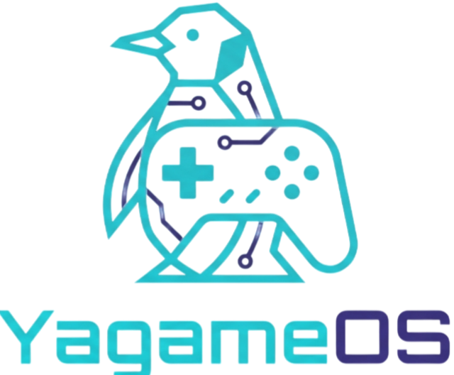

<div align="center">

  

  # [YagameOS] Web Interface & Server (v0.23)

  <p><strong>Subsistema web bare-metal e distribuição oficial do YagameOS para Raspberry Pi 3.</strong></p>

  <p>
    <a href="https://github.com/Gustavo000Yagame/YagameOS_Web">
      
      
      
      
    </a>
  </p>

  

</div>

---

## > DESTAQUES DO PROJETO

* **Servidor HTTP Bare-Metal em Assembly:** Construído do zero em Assembly `x86_64` utilizando *syscalls* nativas do Linux, sem dependência de frameworks externos ou Nginx/Apache.
* **Interface CRT Retro Visual:** Dashboard embutida em HTML5 com simulador de monitor de tubo, linhas de varredura (*scanlines*), iluminação verde fósforo e efeito de curvatura CRT.
* **Integração WebAssembly (WASM):** Validação de versão e rotinas de sistema processadas via cliente em baixo nível.
* **Distribuição Direta da Imagem OS:** Botão de download rápido para a imagem `.img` compilada via Buildroot.

---

## > ESPECIFICACOES DO SISTEMA

<div align="center">
  
</div>

<br>

| Componente | Especificação |
| :--- | :--- |
| **Arquitetura Alvo** | Raspberry Pi 3 (BCM2837 ARMv8 Quad-Core 1.2GHz) |
| **Engine do Kernel** | Buildroot Minimal Subsystem / Direct DRM-KMS Video Engine |
| **Tempo de Boot** | ~4 a 7 segundos (Boot direto na interface retro) |
| **Áudio e Vídeo** | VideoCore IV Direct Render / ALSA Native Driver (Latência ultra-baixa) |
| **Armazenamento** | Sistema de arquivos ext4 Read-Only contra corrupção de dados |

---

## > PLATAFORMAS SUPORTADAS

* **PlayStation 1** *(PCSX ReARMed com Ari64 Dynarec)*
* **Super Nintendo / Mega Drive / Master System**
* **Game Boy / Game Boy Color / Game Boy Advance**
* **Arcade & Neo Geo** *(FBNeo Core Engine)*
* **Atari 2600 / Lynx / PC Engine**

---

## > ARQUITETURA DO REPOSITORIO

```text
YagameOS-Website/
├── server.asm       # Servidor HTTP de alta performance escrito em Assembly x86_64
├── yagame-server    # Binário executável do servidor web
├── index.html       # Interface visual estilo monitor CRT com logo embutido em Base64
├── interface.wat    # Código fonte do módulo WebAssembly (Text Format)
├── interface.wasm   # Executável WebAssembly carregado no browser
├── yagameos.img     # Imagem oficial bootável para o cartão SD
└── YagameOS.png     # Logo oficial do projeto YagameOS
